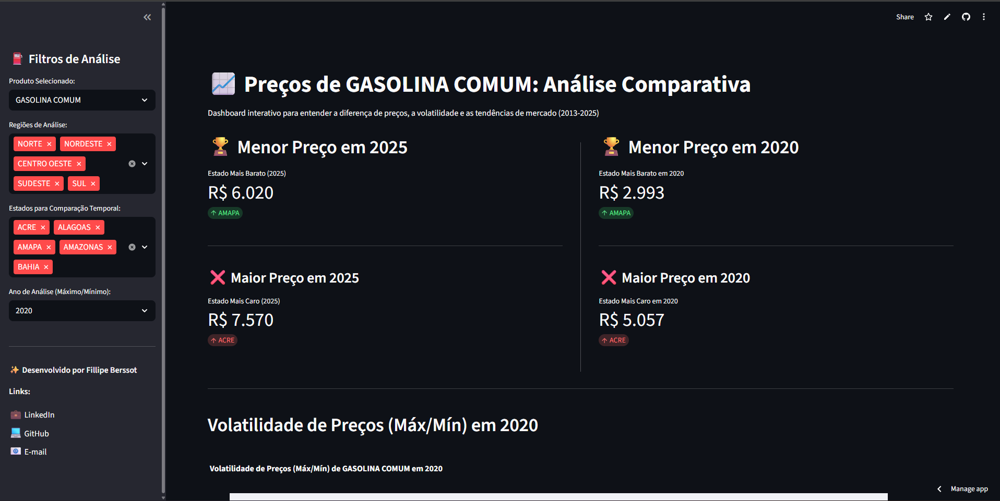
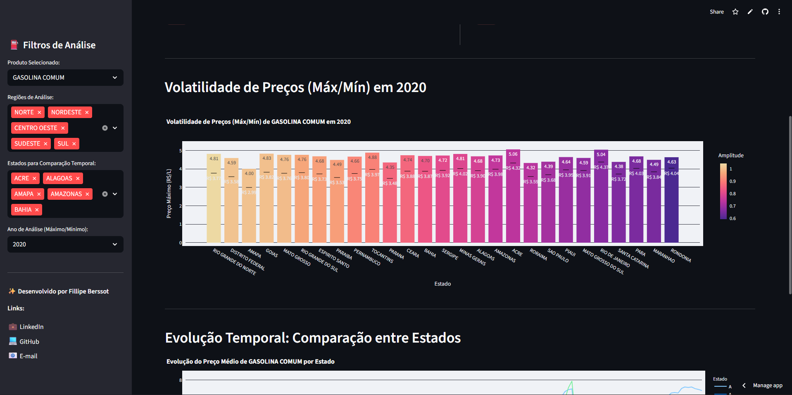
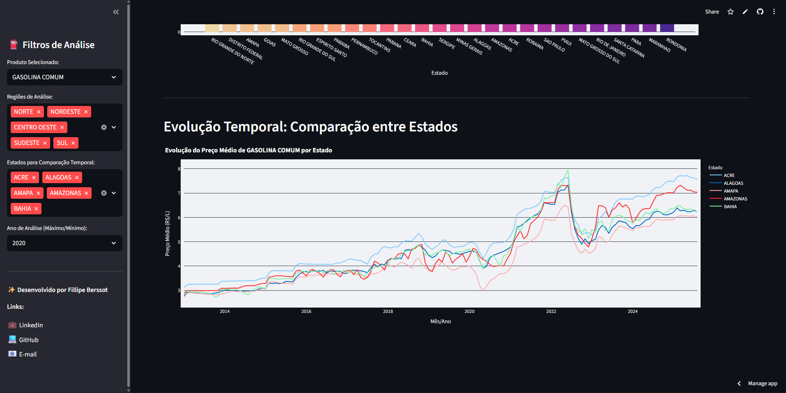

# ⛽ Análise de Preços de Combustíveis (ANP) — Streamlit Dashboard

[](https://precos-energia-br.streamlit.app/)

> Projeto de estudo **prático** de *Data Cleaning*, *Data Analysis* e *Data Visualization* sobre preços de combustíveis da **ANP**, com **dashboard** em Streamlit.
> Destaques: **pandas**, **plotly**, **boas práticas de organização**, **análises reprodutíveis** e **UX**.

---

## 📚 Sumário
- [Arquitetura do Projeto](#-arquitetura-do-projeto)
- [Stack](#-stack)
- [Como Rodar Localmente](#-como-rodar-localmente)
- [O que o Dashboard Mostra](#-o-que-o-dashboard-mostra)
- [Testes Rápidos](#-testes-rápidos)
- [Limpeza de Dados](#-limpeza-de-dados)
- [Principais Análises](#-principais-análises)
- [Visualizações](#-visualizações)
- [Dataset & Atribuição](#-dataset--atribuição)
- [Autor](#-autor)

---

## 📸 Prints do app:  
<details>
  <summary>📸 Ver mais capturas de tela</summary>

  

  
  
  
</details>

---

## 🧱 Arquitetura do Projeto
```text
projeto_gasprices_final/
├── data/
│   └── data_gas_mensal_2013-2025.xlsx      # dataset (ANP)
├── src/
│   ├── data_cleaning.py                    # leitura/limpeza: renomeia colunas, parse de datas e numéricos
│   ├── data_analysis.py                    # lógicas de análise (faixa anual, comparações, min/max)
│   └── data_viz.py                         # gráficos plotly + divisor vertical (Streamlit)
├── tests/
│   ├── test_cleaning.py                    # checagens de limpeza (head/info/describe)
│   └── test_analysis.py                    # sanity checks das análises
├── streamlit_app.py                        # dashboard principal
├── requirements.txt
└── README.md
```

---

## 🔧 Stack
- **Python** 3.12+
- **pandas**, **numpy**
- **plotly** (gráficos interativos)
- **Streamlit** (dashboard)
- **openpyxl** (leitura Excel)
- **Pyarrow** (Engine para Parquet)

---

## 🚀 Como Rodar Localmente

```bash
# 1) Clone o repositório
git clone https://github.com/<seu-usuario>/projeto_gasprices_final.git
cd projeto_gasprices_final

# 2) (Opcional) Crie e ative um ambiente virtual
python -m venv .venv
# Linux/macOS
source .venv/bin/activate
# Windows (PowerShell)
.venv\Scripts\Activate.ps1

# 3) Dependências
pip install -r requirements.txt

# 4) Execute o dashboard
streamlit run streamlit_app.py
```

O app abrirá em **http://localhost:8501**.

---

## 📊 O que o Dashboard Mostra

**Topo (métricas):**
- 🏆 **Menor preço no último ano** disponível do dataset.  
- 🏷️ **Menor** e **Maior preço no ano selecionado** (lado a lado com um divisor vertical).

**Volatilidade (Máx/Mín no ano):**
- Gráfico de barras exibindo **máximo** por estado + marcadores do **mínimo**, com **Amplitude** como escala de cor.

**Evolução temporal:**
- Série temporal do **Preço Médio de Revenda** por **Estado**, com seleção múltipla.

---

## 🧪 Testes Rápidos

Sem `pytest`, os testes são scripts de verificação rápida:

```bash
# Limpeza (confere header, tipos, describe)
python tests/test_cleaning.py

# Análise (faixa anual + “menor preço atual” no conjunto testado)
python tests/test_analysis.py
```

---

## 🧹 Limpeza de Dados

Arquivo: `src/data_cleaning.py`

- Leitura do Excel com `skiprows=16` (layout de origem deste arquivo da ANP).  
- Renomeia colunas para nomes consistentes:  
  `Data`, `Produto`, `Regiao`, `Estado`, `Preco_Medio_Revenda`, `Margem_Media_Revenda`.  
- Converte `Data` para `datetime` e preços/margens para numéricos.  
- Remove linhas sem `Preco_Medio_Revenda`.

> Observação: diferentes versões do arquivo da ANP podem mudar a **linha de cabeçalho**.

---

## 🧠 Principais Análises

Arquivo: `src/data_analysis.py`

- **`calcular_faixa_anual(produto, ano)`** → por **Estado**, retorna **min**, **max** e **Amplitude** (`max - min`).  
- **`preparar_comparacao_temporal(produto, estados)`** → filtra **Produto** + **Estados** para o gráfico temporal.  
- **`preco_mais_barato_atual(df)` / `preco_mais_caro_atual(df)`** → retorna **Estado** e **Preço** (mínimo/máximo) na **última data** disponível.  
- **`preco_mais_barato_anual(produto, ano, estados)` / `preco_mais_caro_anual(...)`** → dentro de **ano** + **estados**, retorna **mínimo/máximo** do **Preço Médio de Revenda**.

---

## 🖼️ Visualizações

Arquivo: `src/data_viz.py`

- **`plot_comparacao_temporal(df, produto)`** → linha temporal por estado (hover unificado, fundo claro).  
- **`plot_faixa_anual(df_faixa, produto, ano)`** → barras (máximo) + marcadores (mínimo), colorindo por amplitude.  
- **`vr(...)`** → divisor vertical (CSS) para layout no Streamlit.

---

## 📝 Dataset & Atribuição

- **Fonte:** Agência Nacional do Petróleo, Gás Natural e Biocombustíveis (ANP) — *Série histórica do Levantamento de Preços*.  
- **Arquivo utilizado:** `data/data_gas_mensal_2013-2025.xlsx`  
- **Uso:** dados públicos/abertos.

---

## 📣 Autor
**Fillipe Berssot**  
💼 [LinkedIn](https://www.linkedin.com/in/fillipe-berssot/) · 💻 [GitHub](https://github.com/FillipeBerssot) · ✉️ fillipeberssot95@hotmail.com
